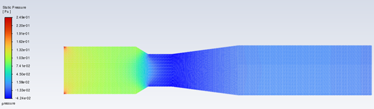
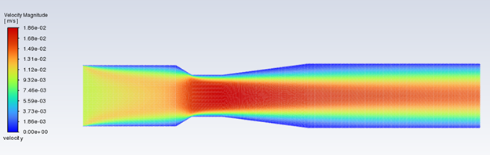
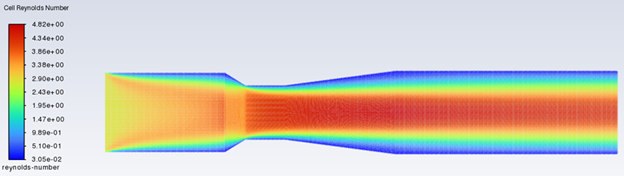

# CFD Analysis of a Venturi Tube using ANSYS Fluent

## Project Overview
This project presents a numerical simulation of incompressible flow through a Venturi tube using ANSYS Fluent. The objective was to analyze velocity distribution, pressure drop, and validate the numerical results with analytical predictions.

## Model Description
- Flow type: Laminar
- Maximum Reynolds number: 4.2
- Inlet velocity: 0.01 m/s
- Fluid: Glycerin
- Mesh type: Structured
- Number of elements: 20,634

## Mesh Independence Study
A mesh independence study was performed to ensure the accuracy of numerical results.

## Results

### Pressure Contour

A noticeable pressure drop is observed at the throat region, in agreement with Bernoulli equation.

### Velocity Contour

### Reynolds Number Contour

## Validation
Simulation results were compared with theoretical predictions based on Bernoulli equation.

## Conclusion
The CFD results showed good agreement with analytical solutions and demonstrated the effectiveness of
